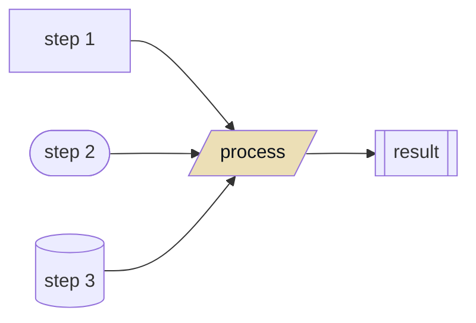

# <center>Project Templates</center>

<div style="text-align:center">

Something.

[](https://github.com/dario-github/project_templates/actions/workflows/main.yml)
[](#)


[English](./README.md) / [简体中文](./README.zh.md)

</div>


## Introduction

Something.

## Pipline

<div style="text-align:center">



</div>

## Installation

```shell
python3.8 -m pip install project-templates
```

## Quick use

Something.

## Development

Welcome to fork and add new features/fix bugs.

- After cloning the project, use the `create_python_env_in_new_machine.sh` script to create a Poetry virtual environment.

- After completing the code development, use the invoke command to perform a series of formatting tasks, including black/isort tasks added in task.py.
  
    ```shell
    invoke check
    ```

- After submitting the formatted changes, run unit tests to check coverage.

    ```shell
    poetry run tox

    ```

## License and Copyright

- [MIT License](./LICENSE)

  - The MIT License is a permissive open-source software license. This means that anyone is free to use, copy, modify, and distribute your software, as long as they include the original copyright notice and license in their derivative works.

  - However, the MIT License comes with no warranty or liability, meaning that you cannot be held liable for any damages or losses arising from the use or distribution of your software.

  - By using this software, you agree to the terms and conditions of the MIT License.

## Contact information

- See more at my github [HomePage](https://github.com/dario-github)
