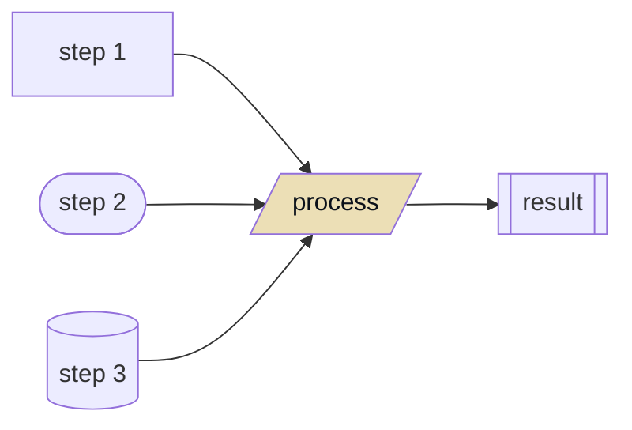

<p align="center">
  
  <h1 align="center">
    Project Templates
  </h1>
  <p align="center">
    Something.
  </p>
</p>

  <p align="center">
    <a href="https://github.com/dario-github/project-templates/actions">
      
    </a>
    <a href="https://codecov.io/gh/dario-github/project-templates">
      
    </a>
    <a href="https://github.com/dario-github/project-templates/graphs/contributors">
      
    </a>
    <a href="https://github.com/dario-github/project-templates">
      
    </a>
  </p>
  
  <p align="center">
    <a href="README.md">English</a>
    /
    <a href="README.zh.md">简体中文</a>
  </p>

## 简介

Something.

## 流程



## 安装

```shell
python3.8 -m pip install project-templates
```

## 使用

Something.

## 开发

欢迎 fork 并 添加功能/修复bug。

- clone 项目后使用`create_python_env_in_new_machine.sh`脚本创建 poetry 虚拟环境。

- 完成代码开发后，使用invoke命令做一系列格式化，`task.py`已添加`black`/`isort`等任务。

    ```shell
    invoke check
    ```

- 提交格式化的修改后，做单元测试，查看覆盖率情况。

    ```shell
    poetry run tox
    ```

## 许可证与版权

- [MIT License](./LICENSE)

  - MIT许可证是一种宽松的开源软件许可证。这意味着任何人都可以自由地使用、复制、修改和分发您的软件，只要他们在其派生作品中包括原始版权声明和许可证。

  - 然而，MIT许可证不提供任何保证或责任，这意味着您不会对使用或分发您的软件而产生的任何损害或损失负责。

  - 通过使用这个软件，您同意接受MIT许可证的条款和条件。

## 联系方式

- 详见 github [个人主页](https://github.com/dario-github)
